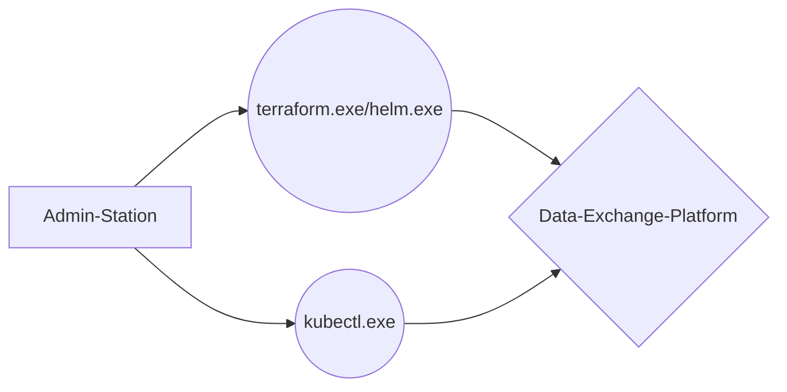

# Data-Exchange-Platform

This **REPO** provides **terraform-** and **k8s-** manifests to build a **data-exchange-platform** with the **infrastructure-as-a-code** approach.
For further informations regading the components, visit the links below.

# BIG-Picture


# INFRASTRUCTURE STACK

## [Exoscale](https://www.exoscale.com/)
## [Terraform](https://www.terraform.io/)
## [K8s](https://kubernetes.io/)
## [Helm](https://helm.sh/)
# APPLICATION STACK
## [Nextcloud](https://nextcloud.com/)
## [MariaDB](https://mariadb.org/)
## [Traefik](https://doc.traefik.io/traefik/providers/kubernetes-ingress/)
## [Longhorn](https://longhorn.io/)


## Treeview
```bash
├───k8s
│       cloudflare-credentials.yaml #Cloudflare Credentials for LetsEncryptCert for Traefik
│       hpa.yaml #Horizontal POD Autoscaler Configfile
│       ingress-rule.yaml #Ingress Rule for Traefik
│       limit_pod_ressources.yaml #LIMIT the POD Ressources for HPA
│       s3-secret.yaml #S3 Secrets for Longhorn Backup
│
│
└───terraform
    ├───longhorn
    │       longhorn.tf #Longhorn Deplyoment via HELM
    │
    ├───nextcloud
    │       nextcloud.tf #Nextcloud Deplyoment via HELM
    │       values.yaml #Nextcloud Custom Values File
    │
    ├───s3
    │       dep-longhorn-backup.tf #S3 Bucket Deployment at Exoscale
    │
    ├───sks
    │       sks.tf #Kubernetes-Cluster Deployment at Exoscale
    │
    └───traefik
            traefik.tf #Traefik Deplyoment via HELM
            values.yaml #Traefik Custom Values File
```
            
## Flowchart

