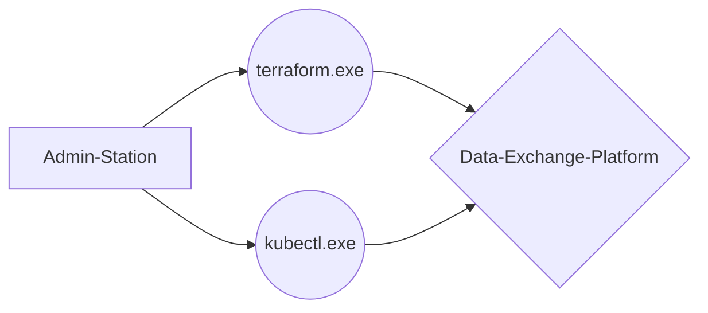

# Data-Exchange-Platform

This **REPO** provides **terraform-** and **k8s-** manifests to build a **data-exchange-platform** with the **infrastructure-as-a-code** approach.

# Components

## Exoscale
## Terraform
## K8s

## Treeview
├───k8s
│   ├───autoscaling
│   │       ├───hpa_adv.yaml
│   │       ├───limit_pod_ressources.yaml
│   │
│   └───traefik
│           traefik_ingress.yaml
│
└───terraform
    ├───longhorn
    │       longhorn.tf
    │
    ├───nextcloud
    │       nextcloud.tf
    │       values.yaml
    │
    ├───s3
    │       s3.tf
    │
    ├───sks
    │       sks.tf
    │
    └───traefik
            traefik.tf
            values.yaml
            
## Flowchart

