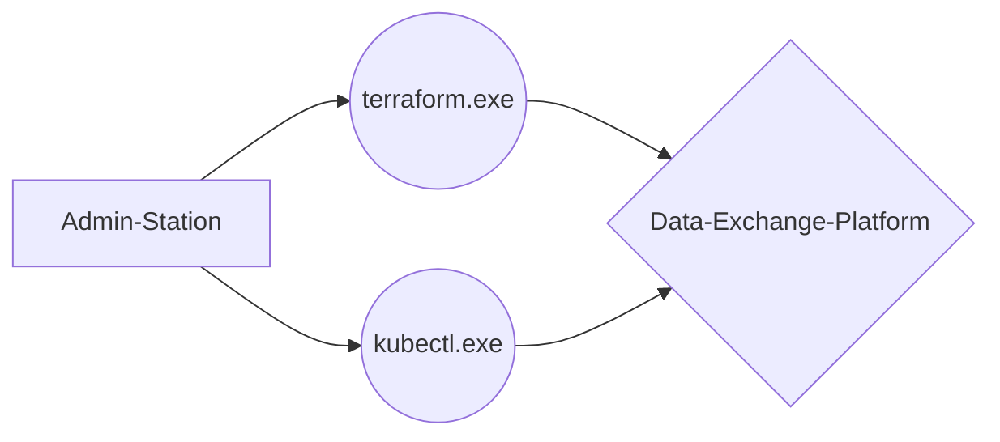

# Data-Exchange-Platform

This **REPO** provides **terraform-** and **k8s-** manifests to build a **data-exchange-platform** with the approach of **infrastructure-as-a-code**.

# Components

## Exoscale
## Terraform
## K8s

## Treeview

## Flowchart

